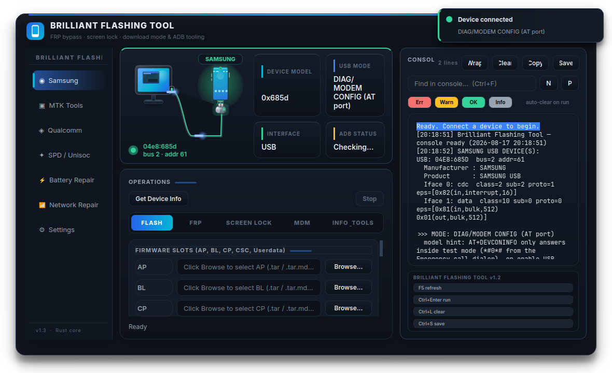
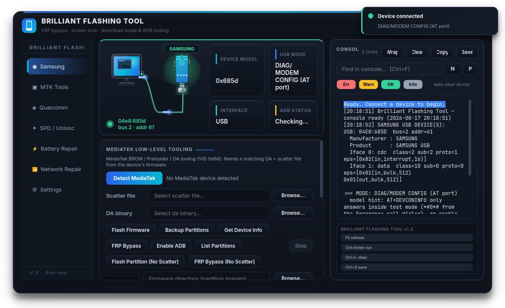
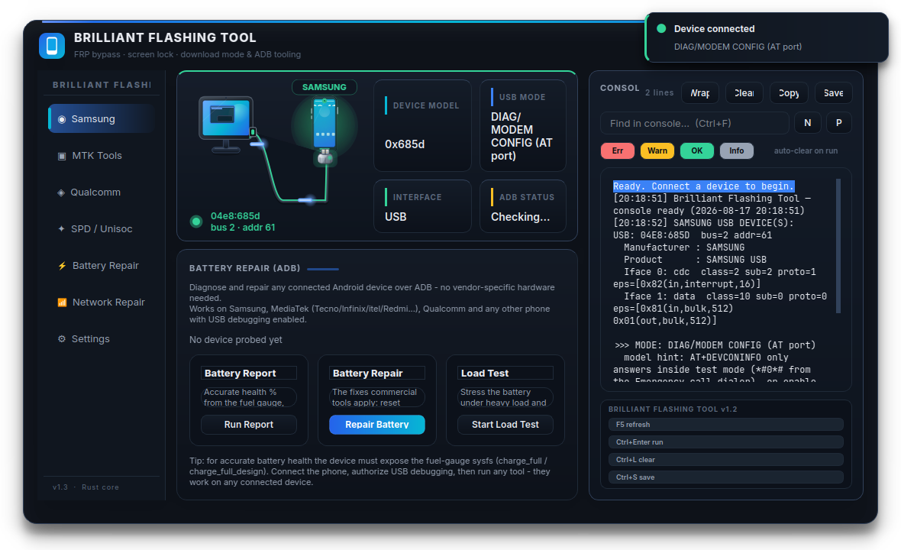
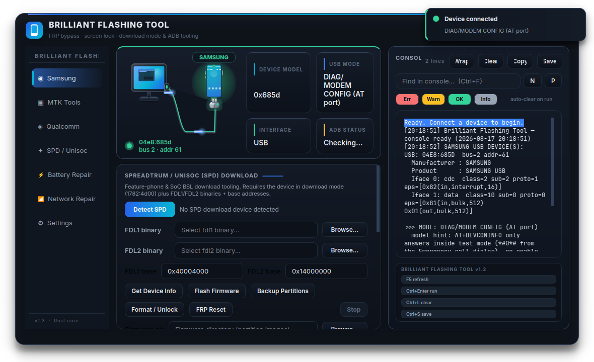

# 🔧 Brilliant Flashing Tool

> **The open-source, cross-platform-grade flashing & repair workbench for Samsung, MediaTek, Qualcomm and Spreadtrum/UNISOC devices — powered by a native Rust core and a polished PyQt6 studio.**

[](https://www.rust-lang.org)
[](https://www.python.org)
[](https://www.riverbankcomputing.com/software/pyqt/)
[](LICENSE)
[](CONTRIBUTING.md)

**What is this?** A Linux-native equivalent of the paid Windows flashing suites — one unified tool that talks straight to the bootloader of **Samsung, MediaTek, Qualcomm and Spreadtrum/UNISOC** phones. No Windows VM, no crack, no gray-market server: everything runs on your own machine.

---

## ✨ Why this project matters

The Android repair world runs on closed, Windows-only commercial tools. Their protocols are reverse-engineered by a small community of tinkerers — and most of that knowledge is locked inside paid executables or scattered across forum threads.

**This project is our answer.** It turns those reverse-engineered protocols into a clean, auditable, MIT-licensed codebase that anyone can read, run, extend — and ship as their own flashing suite.

| Commercial tool | Windows-only, closed source | This project |
|---|---|---|
| Odin / Smart Switch | Windows, GUI only | Open-source Odin protocol + leaked odin4 + PIT tools |
| MTK flash tools | Windows, closed DA | MTK BROM/DA flashing & backup (scatter + GPT) |
| Qualcomm EDL tools | Windows | Sahara + Firehose protocol implementation |
| SPD/UNISOC tools | Windows | Clean-room BSL download implementation |
| FRP / lock tools | Paid, grey-market | Transparent ADB + download-mode flows, MDM unlock |

---

## 🚀 Highlights

- **8 transport modes** — ADB, MTP, Samsung Download mode, Samsung BROM, MTK, MTK BROM, Fastboot, Qualcomm EDL.
- **8 job categories, ~120 operation methods** — flashing, FRP bypass, screen-lock removal, MDM unlock, device info, reboot, settings/UI repair, and more.
- **Rust core (`brilliant-bridge`, ~9.3k LOC)** — raw USB with a *vendored libusb* (no system deps), real protocol implementations:
  - **Samsung**: reverse-engineered Odin session protocol (Heimdall-based), HID download-mode payloads, PIT read/write/flash.
  - **MediaTek**: BootROM / preloader / Download-Agent handshake, scatter & GPT partition flashing, BROM exploits, SLA keys, dealer & emergency modes.
  - **Qualcomm**: Sahara handshake, Firehose session, rawprogram.xml flashing, backup.
  - **SPD/UNISOC**: clean-room BSL (Boot Service Layer) — FDL download, format, FRP erase, partition dump/flash.
  - Plus **MTP**, **AT-command**, and full **ADB** plumbing.
- **A studio-grade GUI** — frameless translucent window, 5 accent themes, animated cable/status scene, live console with find/wrap/save, toast notifications, keyboard shortcuts, and per-chip sub-tab workbenches.

---

## 📸 Screenshots

| Samsung ops | MediaTek workbench | Battery repair | SPD download |
|---|---|---|---|
|  |  |  |  |

---

## 🧩 Feature matrix

| Capability | Samsung | MediaTek | Qualcomm | SPD/UNISOC | Any ADB |
|---|---|---|---|---|---|
| Detect / info | ✅ | ✅ | ✅ | ✅ | ✅ |
| Flash firmware | ✅ (Odin / odin4) | ✅ (scatter + GPT) | ✅ (Firehose) | ✅ (FDL/regions) | — |
| Backup partitions | ✅ (EFS) | ✅ | ✅ | ✅ | — |
| FRP bypass | ✅ (ADB + download) | ✅ | ✅ (EDL) | ✅ | ✅ |
| Screen-lock removal | ✅ | ✅ | ✅ (EDL) | — | ✅ |
| MDM unlock | ✅ (ADB, QR, recovery) | — | — | — | — |
| Partition tools | ✅ (PIT) | ✅ (GPT) | ✅ | ✅ | — |
| Low-level exploits | ✅ (HID/BROM) | ✅ (BROM exploit, SLA) | ✅ (Sahara) | ✅ (BSL) | — |
| Battery / network repair | — | — | — | — | ✅ |

> 💡 **Battery** and **Network** sections work on *any* Android device with USB debugging — no vendor hardware needed.

---

## 🖥️ The GUI

A frameless, translucent, radius-card window with a live **connection banner** (computer → cable → phone scene with an animated data pulse) above a left **nav rail** and a right **console/log column**.

- **Samsung** — TFT-style sub-tabs: `FLASH · FRP · SCREEN LOCK · MDM · INFO & TOOLS`.
- **MediaTek / Qualcomm / SPD** — dedicated workbenches with the same sub-tab layout plus their native low-level tools (scatter/DA, programmer/XML, FDL binaries, base-address inputs).
- **Battery** — fuel-gauge health %, temp/voltage/current, top consumers; one-click repair.
- **Network** — SIM state, data/Wi-Fi flags, DNS mode; radio reset & re-registration.
- **Settings** — auto-scan interval, default paths, console auto-clear, 5 accent themes, animations, window glow, engine status, and in-app `cargo build`.

**Shortcuts:** `F5` rescan · `Ctrl+Enter` run · `Ctrl+L` clear console · `Ctrl+S` save log · `Ctrl+F` find.

---

## 📦 Quick start

**Requirements:** Rust toolchain, Python 3.10+, a Linux desktop. That's it — libusb is vendored.

```bash
# 1. Build the Rust bridge (first build compiles libusb from source)
cargo build --release

# 2. (Recommended) install the USB udev rules so phones need no sudo
sudo bash root/setup-usb.sh

# 2b. Fetch the proprietary odin4 binary (Samsung download-mode flashing).
#     It is NOT redistributed here for legal reasons; this pulls it from a
#     public mirror and verifies it runs.
bash scripts/fetch-odin4.sh

# 3. Python environment
python3 -m venv .venv
.venv/bin/pip install -r requirements.txt

# 4. Launch
.venv/bin/python -m python.main        # or: python3 main.py
```

The **odin4** tool (Samsung download-mode flashing) is fetched at setup by `scripts/fetch-odin4.sh` — Samsung's proprietary binary is not redistributed in this repo. Samsung combo firmware should go in `~/Downloads` (or set `COMBINATION_TAR`).

### CLI / bridge

```bash
./target/release/brilliant-bridge detect          # all USB + Samsung filter (JSON)
./target/release/brilliant-bridge mtk-detect      # MediaTek BROM/preloader/DA
./target/release/brilliant-bridge qcom-detect     # Qualcomm EDL
./target/release/brilliant-bridge spd-detect      # Spreadtrum/UNISOC
./target/release/brilliant-bridge odin-pit 04e8:xxxx@bus:addr  # read PIT
./target/release/brilliant-bridge at-send <t> ATI # AT over CDC ACM
./target/release/brilliant-bridge adb-devices     # adb devices -l as JSON
```

---

## 📁 Repository layout

```
brilliant/
├── src/                      # Rust bridge (~9.3k LOC)
│   ├── main.rs               #   command-line entry (60+ commands)
│   ├── usb.rs                #   USB enumeration / interfaces
│   ├── hid.rs bulk.rs        #   Samsung HID + bulk endpoints
│   ├── odin.rs               #   reverse-engineered Odin session protocol
│   ├── mtk.rs mtk_da.rs      #   MediaTek BROM/DA flashing
│   ├── mtk_exploit.rs        #   BROM exploits (mtk_bypass/kamakiri2/patch_da)
│   ├── mtk_sla.rs            #   MediaTek SLA key handling
│   ├── qualcomm/             #   Sahara + Firehose + GPT (EDL)
│   ├── spd.rs                #   Spreadtrum/UNISOC BSL protocol
│   ├── mtp.rs at.rs adb.rs   #   MTP, AT command, ADB plumbing
│   └── config.rs error.rs util.rs
├── python/
│   ├── core/
│   │   ├── frp.py            #   flow orchestrator: 8 jobs / 68 flows / 8 modes
│   │   ├── bridge.py         #   talks to the Rust binary
│   │   ├── adb.py mtp.py pit.py mtk.py usb_watch.py
│   └── gui/
│       └── qt_app.py         #   the whole PyQt6 studio (~6.2k LOC)
├── docs/                     # screenshots + logo
├── root/                     # udev rules (odin4 fetched by scripts/fetch-odin4.sh)
├── scripts/                  # fetch-odin4.sh, dev scripts
├── pit/ mdm_qr/              # sample PIT + MDM QR provisioning assets (git-ignored)
└── tests/                    # pytest suite (flow, MTK, PIT)
```

---

## 🧑‍💻 Contributing

**This project only gets better with you.** We want maintainers, protocol hackers, GUI designers, doc writers, and testers.

- **[CONTRIBUTING.md](CONTRIBUTING.md)** — everything you need to start.
- **Beginner-friendly tasks** — every `flow_*` function in `python/core/frp.py` is an opportunity: add a method, tune a command sequence, wire up a new device combo.
- **No prior flashing experience required.** The flow framework (`python/core/frp.py`) is dead simple — a new method is ~5 lines:

```python
def flow_my_method():
    return Flow("my method", [Step("do thing", lambda ctx, log: log("hi"))])

FLOWS["my_method"] = flow_my_method
```

It appears in the GUI automatically. That's the whole contribution loop: **write a flow, ship a feature.**

**Ideas we'd love help with:**
- New device models / firmware combos in the flow tables.
- MediaTek DA variants, new scatter/GPT quirks.
- Qualcomm rawprogram & patch XML edge cases.
- Additional FRP / lock-removal methods per Android version.
- Packaging (Flatpak, AppImage, AUR, `cargo` + `pip`), CI, unit tests.
- More ODIN protocols, eMMC/UFS tooling, iCloud-adjacent and EDL utilities.
- Translations, themes, and accessibility.

---

## 🛡️ Safety & legality

This tool talks directly to bootloaders and can wipe data or brick a device if misused.

- Use it only on **devices you own or are authorized to service** (repair shops servicing customer phones with consent).
- Always read the on-screen warnings and **back up partitions** before flashing.
- Bypassing FRP/MDM on a device you don't own may be **illegal in your jurisdiction** — you are responsible for how you use this software.
- The project ships **no proprietary "secret sauce"** (HID unlock payloads, leaked DAs are *not* vendored) — you supply the firmware/binaries for your specific device, exactly like every commercial tool requires.

---

## 📄 License

MIT — see [LICENSE](LICENSE). The Odin protocol constants are derived from the Heimdall project (MIT), and the SPD BSL reference comes from clean-room protocol write-ups (spd_cmd.h / Opus-Spreadtrum, ilyakurdyukov). Everything here is yours to read, fork, and build on.

---

**Star ⭐ this repo, open an issue, send a PR — and let's build the best open flashing suite on Linux together.**